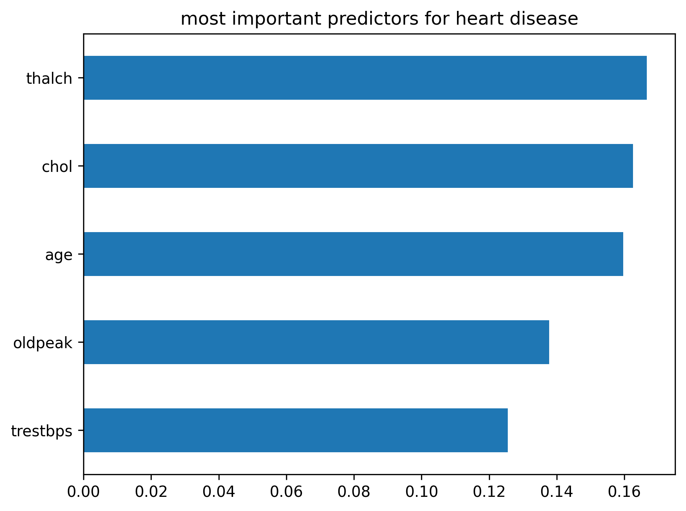

# 9.8.25IDS706DataAnalysisProject
- ## I followed the steps from the first assignment to make a README, Makefile, add in requirements, and make files for coding/analysis
    - Created a new repository with a README and git ignore file
    - Created python scripts for my analysis and to test my code
    - Created Makefile for install, test, lint, format, clean requirements.txt — pinned dev dependencies
    - Imported csv of heart health data from kaggle (file named cleanned.csv)

## Project Structure

```bash
.
├── analysis.py
├── .gitignore
├── test_analysis.py
├── cleanned.csv
├── TestsPassed.png
├── Dockerfile
├── README.md
├── Makefile
├── IDS706HeartRateVisualization.png
├── requirements.txt
└── .github/
    └── workflows/
        └── python.yml


## Created a virtual environment with this code:
 cd ~/Downloads/9.8.25IDS706DataAnalysisProject python3 -m venv .venv
 source .venv/bin/activate

## Put some utilities inside my Makefile: 
install:
	pip install --upgrade pip && pip install -r requirements.txt

format:
	black *.py

lint:
	flake8 *.py

test:
	pytest -vv --cov=analysis --cov-report=term-missing

run:
	python analysis.py

clean:
	rm -rf __pycache__ .pytest_cache .coverage

all: install format lint test


## Put my dependencies in my requirements.txt file: 
pylint
flake8
pytest
click
black
pytest-cov
pandas
scikit-learn
numpy
matplotlib


 Ran in  terminal: make install, make test, make run

## The goals of this analysis were:
-  Data exploration and filtering
-  Grouping operations
-  Train and evaluate a Random Forest model to identify predictors of heart disease
-  Visualize results


## Operations performed to get familiar with the data:
-  first imported pandas
-  df.head() foor preview of first rows
-  df.info() and df.describe() for summary statistics and data types
-  filtering by age and sex
-  grouping by sex and finding summary statistics of cholesterol


## Used a Random Forest Classifier to predict of heart disease
-  first imported sklearn's train_test_split, RandomForestClassifier, accuracy_score, classification_report
-  Created dummies for discrete variables with pd.get_dummies()
-  Split dataset into 80% training and 20% testing with train_test_split
-  Let heart disease be the outcome variable and everything else be explanatory
-  Trained a Random Forest with 50 decision trees
-  Evaluated accuracy, precision, recall, and F1-score on the test set
- The Random Forest achieved an accuracy score of about 0.587. Key predictors of heart disease in this dataset included:

### Imported matplotlib and created a feature importance plot to show which the biggest predictors of heart diease
-  thalch (maximum heart rate achieved)
-  chol (serum cholesterol)
-  age
-  trestbps (resting blood pressure)
-  oldpeak (ST depression induced by exercise)
-  These align with known medical risk factors for heart disease
-  the script saves a horizontal bar chart of the top 5 features to IDS706HeartRateVisualization.png



##Dockerfile & how I run this project in Docker
A Dockerfile is included to make the environment reproducible (installs requirements, copies project files).
Build the image:
    -   docker build -t ids706-proj .
Run the analysis (uses the image’s default command which runs python analysis.py):
    -   docker run --rm -it ids706-proj
Run Makefile targets (inside Docker, using the files baked into the image):
    -   docker run --rm -it ids706-proj make test
    -   docker run --rm -it ids706-proj make run
